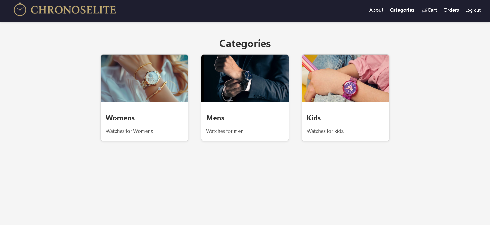
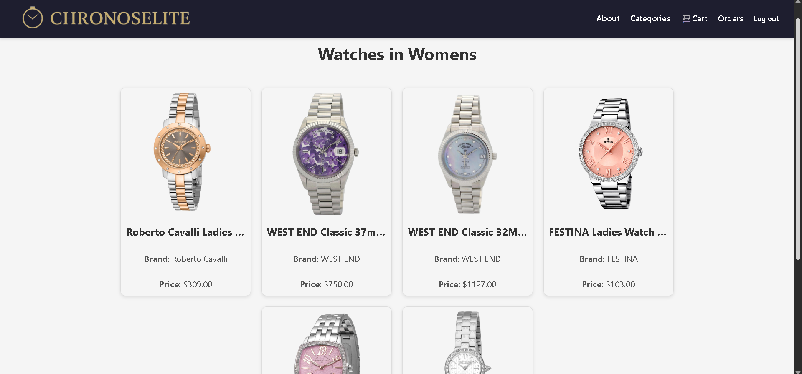
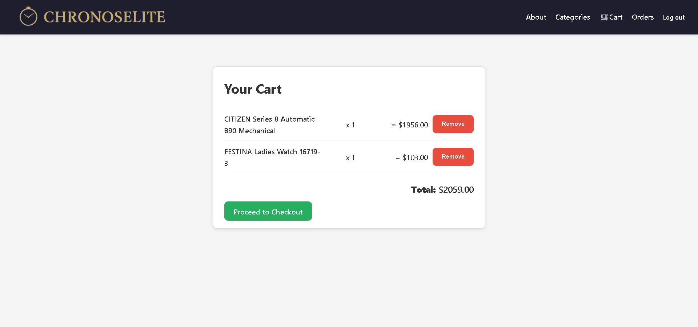
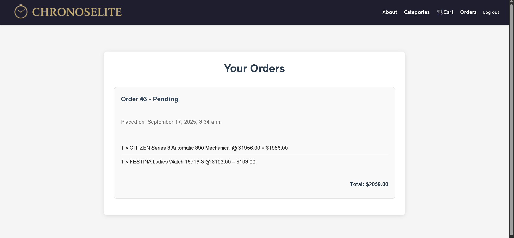

# ⌚ChronosElite
A WatchStore, user-friendly e-commerce app for browsing, selecting, and purchasing watches. Built with Django and PostgreSQL, this app features product categorization, watch straps, and a shopping cart system.

## 🔗 Try It Out
👉 [ChronosElite](https://chronoselite.onrender.com/)

## ✨Features
- Browse watches by category (Mens, Womens, Kids)
- View watch details and images
- Add to cart and manage multiple items
- Order history for users
- Responsive and user-friendly design

## 🛠 Tech Stack
- Backend: Django
- Database: PostgreSQL
- Frontend: HTML, CSS,

## Models
- User
- Category
- Watch
- Cart
- CartItem
- Order 
- OrderItem 

## 🎯 App Preview

## 🗃 ERD
