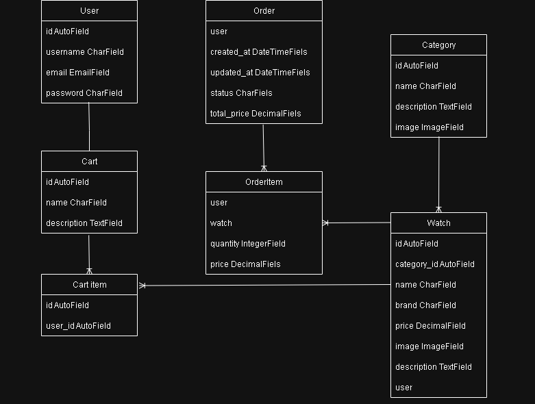

# ⌚ChronosElite
A WatchStore App, user-friendly e-commerce app for browsing, selecting, and purchasing watches. Built with Django and PostgreSQL, this app features product categorization, watch straps, and a shopping cart system.

## ✨Features
- Browse watches by category (Mens, Womens, Kids)
- View watch details and associated straps
- Add to cart and manage multiple items
- One-to-one relation between user and cart
- Responsive design for a seamless experience

## 🛠 Tech Stack
- Backend: Django
- Database: PostgreSQL
- Frontend: HTML, CSS,

## Models
- User
- Cat
- Watch
- Strap
- Cart
- CartItem

## 🗃 ERD

